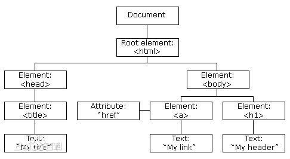

#dom笔记#
##文档对象模型##

因为dom，HTML中的所有对象才能被js所控制

##dom分级##
###1级DOM###
由DOM核心与DOM HTML两个模块组成。**仅以映射文档结构为目标**
###2级DOM###
增加了对鼠标和用户界面事件（DHTML长期支持鼠标与用户界面事件）、范围、遍历（重复执行DOM文档）和层叠样式表（CSS）的支持。同时也对DOM 1的核心进行了扩展，从而可支持XML命名空间。

	新dom模块

	DOM视图：描述跟踪一个文档的各种视图（使用CSS样式设计文档前后）的接口
	DOM事件：描述事件接口
	DOM样式：描述处理基于CSS样式的接口
	DOM遍历与范围：描述遍历和操作文档树的接口

###3级DOM###
包含一个名为“DOM载入与保存”的新模块，DOM核心扩展后可支持XML1.0的所有内容，包括XML Infoset、 XPath、和XML Base。
###"0级"DOM###
并没有标准被称为0级DOM，它仅是DOM历史上一个参考点

##节点##

##如何访问节点##
###获取节点###
getElementById()

	getElementById("ID")
	在 XML 文档中，您必须通过拥有类型 id 的属性来进行搜索，而此类型必须在 XML DTD 中进行声明。

getElementsByTagName() 

	一.document.getElementsByTagName("标签名称");[所有标签]
	二.document.getElementById('ID').getElementsByTagName("标签名称");[指定ID标签中的标签]
###获取&改变元素值###
	x=对象.nodeValue;
	对象.nodeValue="xxxx"
###获取&改变属性值###
	一.返回值：对象.getAttribute("属性");
	二.获取：对象.getAttributeNode("属性");
	改变：
	    对象.setAttribute("属性","值");
	    获取的属性.nodeValue="值";

